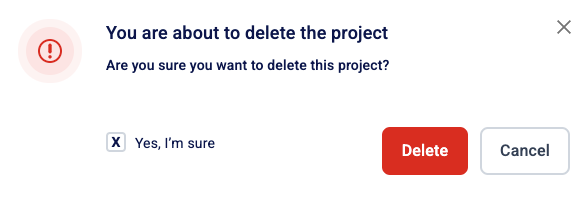

# 🗑️ Delete a project

To delete a project:

1. Click .png>) **Projects** on the left-hand side navigation pane.
2. Click the .png>) **Settings** button next to the desired project. On the shortcut menu, click **Delete project**.

<figure><figcaption></figcaption></figure>

3. In the confirmation message, select the **Yes, I’m sure checkbox** and then click **Delete**.

<figure><figcaption></figcaption></figure>


* Deleting a project also completely erases all tests run under the project, so proceed with caution.
* Deleted projects cannot be restored.

